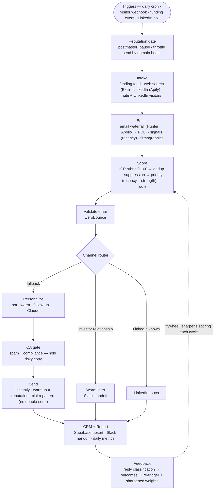

# GTM Engine

A production-grade, **QA-at-every-node** B2B outbound GTM automation pipeline. A daily cron plus real-time triggers turn raw company signals into personalized, compliant, multi-channel outreach, with a quality gate and a quarantine path at every step.

Built to a GTM-engineering standard: typed contracts, an explicit state machine, idempotent and resumable runs, dead-letter quarantine, and a recency-and-relevance-weighted scoring flywheel. It runs **keyless as a clean no-op**, so you can watch the whole funnel execute without a single API key.

## See it run (no keys, no network)

```bash
python -m scripts.run_pipeline --demo
```

```
=== GTM Engine pipeline run (demo=True, keyless=yes) ===
  routed    : 2 hot / 0 warm / 2 cold
  held(spam): 1

  company           source            score tier stage      spam hold
  Northwind Labs    funding_feed         91   A   hot           0
  Quickwin SaaS     funding_feed         87   A   hot         100  spam_risk   <- held by the compliance gate
  Tagus Analytics   website_visitor      35   C   cold
  FarCorp Logistics exa_web_search        0   D   cold
```

Synthetic leads flow through every stage; the deterministic ICP rubric scores them, the router buckets them, and the spam/compliance gate holds the deliberately-spammy draft before it could ever reach a mailbox.

## The pipeline



> Every node has a typed input/output contract, a self-validating QA gate, an explicit Supabase `pipeline_state` transition (idempotent + resumable cron), and quarantines bad records to a `dead_letter` table. A record that fails a gate is never silently dropped or passed downstream.

**Every node** has a typed input/output contract, a self-validating QA gate, an explicit Supabase `pipeline_state` transition (so the cron is idempotent and resumable), and quarantines bad records to a `dead_letter` table. A record that fails a gate is never silently dropped or passed downstream.

## What makes it production-grade

- **QA at every node, not just at the end.** Each stage validates its own output before handing off (schema / regex / threshold checks, plus LLM-as-judge for the copy nodes). A failing record is quarantined with the node, reason, and payload.
- **Typed contracts.** A single Pydantic `Lead` model is the contract between nodes (`scripts/common/contracts.py`); lenient on ingest, strict at the gates.
- **Idempotent and resumable.** Every lead carries a `pipeline_state` cursor; a node only acts on records in its input state and advances them out of it, so a re-run never double-processes and a crashed cron resumes where it stopped.
- **No double-sends.** The send node uses a claim → send → confirm → reconcile pattern, so a send is at-most-once even if a result-persist fails mid-run.
- **Compliance fail-closed.** Suppression (reply / bounce / unsubscribe) is enforced at dedup and re-checked at send; if the CRM is unreachable the engine refuses to send rather than risk contacting a suppressed address. Email addresses are verified before any copy is drafted.
- **Recency + relevance scoring flywheel.** Priority weights a fresh, strong buying signal far above a stale one (exponential recency decay × signal strength), and outcomes feed back to sharpen the weights over cycles.
- **Provider-agnostic and smoke-safe.** Every external integration goes through a soft-failing HTTP layer and is gated on its key; with no keys the whole pipeline is a clean no-op, which is what makes `--demo` above possible.

## Channels

Outreach is multi-channel and picks the highest-trust available path per lead:

1. **Investor warm-intro** — when a lead's lead-investor is a known relationship, route to a human intro request instead of a cold touch.
2. **LinkedIn** — when a profile is known and the LinkedIn integration is configured.
3. **Cold email** — the fallback, sent through warmed, rotated inboxes.

## Stack

Python · [Windmill](https://www.windmill.dev) (orchestration / cron / webhooks) · Supabase (Postgres: CRM + pipeline state) · Instantly (cold-send + warmup + tracking) · Claude (ICP field extraction + copywriting) · Exa, Apify, Hunter, Apollo, PDL, Proxycurl, Clearbit, Unipile (sourcing + enrichment) · ZeroBounce (email verification) · Slack (handoff + alerts). Runtime deps are kept light (httpx for every vendor API).

## Quickstart

```bash
# 1. Run the full funnel keyless (synthetic leads, no real sends)
python -m scripts.run_pipeline --demo        # or:  make dry-run   (containerized)

# 2. Bring up Windmill locally to see / run the DAG
make windmill                                 # http://localhost:8000

# 3. Configure for a real run
cp .env.example .env                          # fill in the keys you have
psql "$SUPABASE_DB_URL" -f scripts/sql/schema.sql
python -m scripts.run_pipeline
```

See [`DOCKER.md`](DOCKER.md) for the containerized setup and Windmill details.

## Layout

```
scripts/
  common/      contracts (Pydantic), config, http, and vendor clients (Supabase, Instantly, Exa, …)
  intake/      lead sourcing: funding feed, web search, LinkedIn, visitor drains
  enrich/      email waterfall, signals, firmographics
  score/       ICP rubric, priority, routing, channel selection, feedback model
  personalize/ hot / warm / follow-up copywriters + value-hook builder
  email/       spam + compliance gate, email validation, send, warmup, postmaster
  crm/         dedup + suppression, upsert, lifecycle, Slack handoff, reply handling
  report/      daily metrics
  sql/         schema + migrations
windmill/      the orchestration flow(s) as OpenFlow JSON
```

## Status

A working reference implementation. The architecture (contracts, state machine, dead-letter, QA gates) is in place; a DeepEval/pytest gate suite and full migration of every node into the formal envelope are the next milestones.
